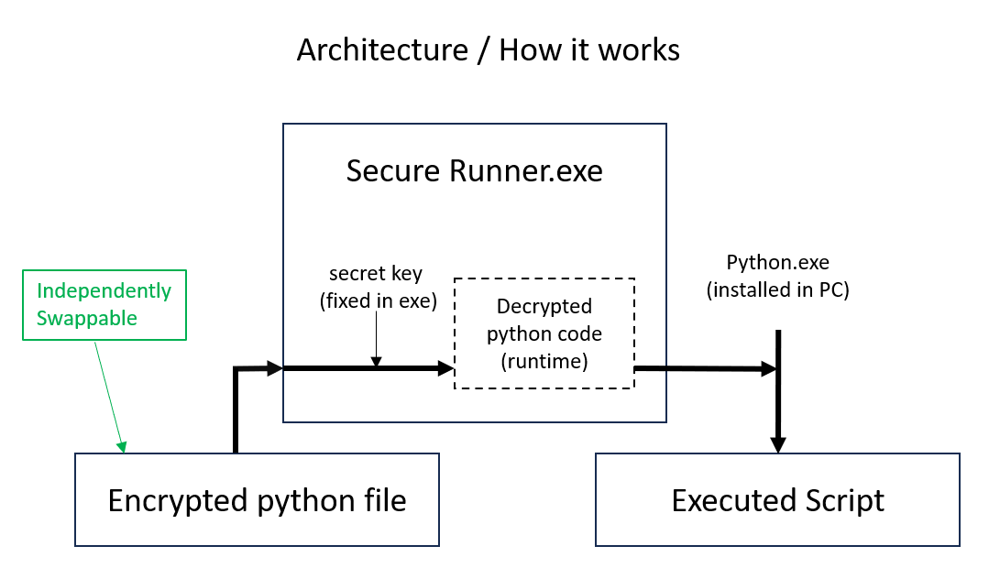

# Secure-Runner
A lightweight rust based tool to **execute pre-encrypted Python scripts** 
   — a new and neat approach to code obfuscation.

## What this project is for 

Those of us who create code with following objectives 

- Prevent casual inspection at code / code modification 
- Share / Distribute the code to other users 
- frequently update the code logic and share (nothing legacy about that)
- Not create any temp files that can expose the logic

## How it works

## Why Not Just Use Obfuscation?

Traditional obfuscation often relies on Obfuscation services in **third-party or sketchy websites**,  
which can compromise both **security and privacy**.

This project keeps everything local — **no third-party obfuscators required**.

## 🧠 Summary

| Feature | Plain Python | PyInstaller | Encrypted Executor |
|----------|---------------|--------------|--------------------|
| Protected Source Code | ❌ | ✅ | ✅ |
| Authenticity | ❌ | ✅ | ✅ |
| File Size | ✅ Small | Huge | ✅ Small |
| Upgradable |✅  | Rebuild Required (slow)| ✅ Swap File |
| Secure Sharing | ❌ | ✅ | ✅ |
| Cross-Platform | ✅ | Limited | ✅ |

## why not PyInstaller?

| Problem with PyInstaller | This Project’s Advantage |
|---------------------------|---------------------------|
| Produces executables ≥ 10 MB | Tiny encrypted script files |
| Slow startup | Instant script execution |
| Incompatible with ARM-based Windows | Works on any system running Python |
| Large libraries inflate size | Only encrypted code changes — no rebuild needed |
| Takes time to generate executables | Simply swap the encrypted file to upgrade |

## 📦 Distribution Made Simple

Sharing `.exe` files can be painful:
- 📧 Large attachments pile up in mailboxes  
- 🧱 Security software blocks executables 
- Unable to track code changes in exe 

**With this Solution:**  
Share tiny encrypted `.enc` file instead!  
They’re lightweight, email-friendly, and easy to update - by swapping the file in the folder
Can easily reproduce  the original python file, encrypted python file, exe file by same encryption key.

## ⚠️ Limitations   

This is **not a 100% secure system** — advanced reverse engineering can still expose code. It's supposed to merely deter users from code editing.  
That said, it can potentially be used to share malware code. In case of such doubts, you can always ask the author for secutiy key and inspect the code for malware.  
However, I find it as 2nd of the most practical approach to the above problem. 
First one being distributing code as web service.   PS - Check out streamlit python library.
